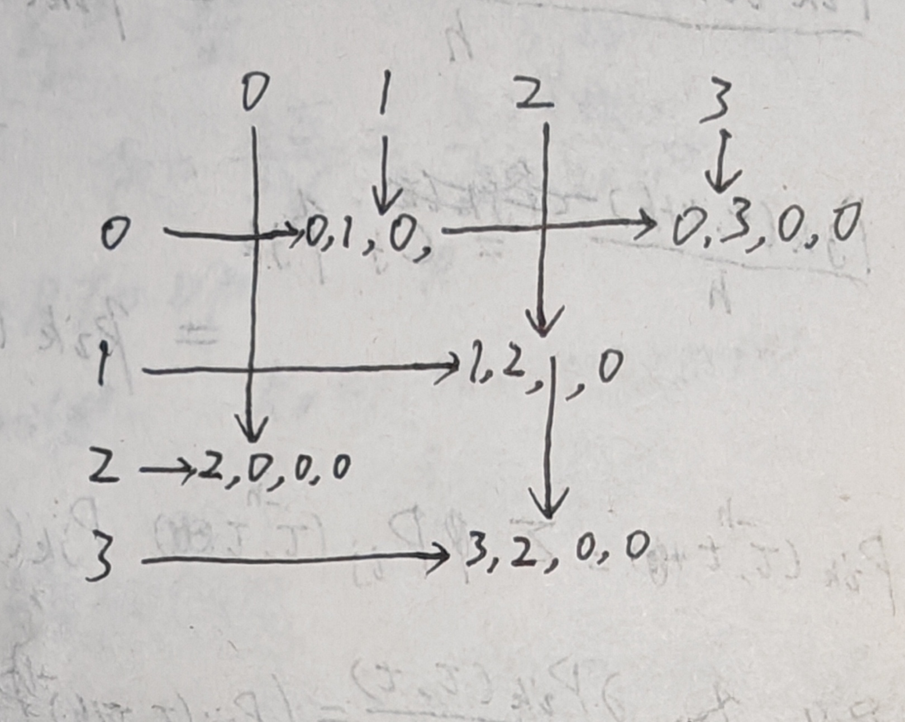

1. Adjacency Matrix
$$
\begin{matrix}
0 & 1 & 0 & 1\\
0 & 0 & 1 & 0\\
0 & 0 & 0 & 0\\
0 & 0 & 1 & 0\\
\end{matrix}
$$

2. Adjacency List
- Vertex 0: → 1 → 3 → NULL
- Vertex 1: → 2 → NULL
- Vertex 2: → NULL
- Vertex 3: → 2 → NULL

3. Adjacency Multilist
